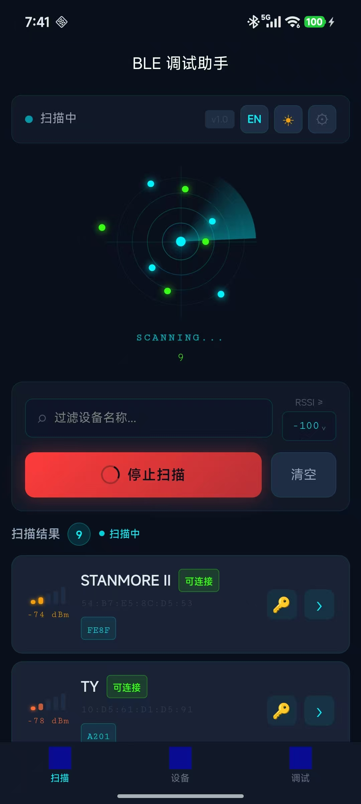
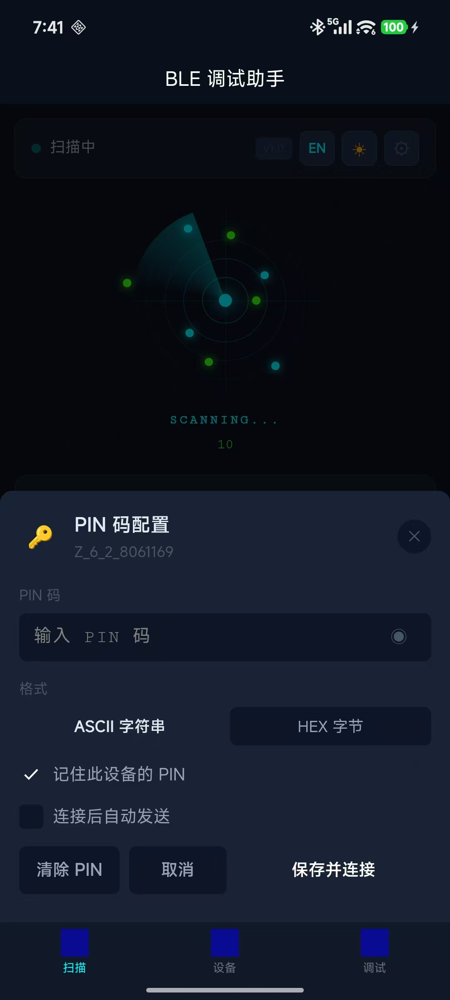
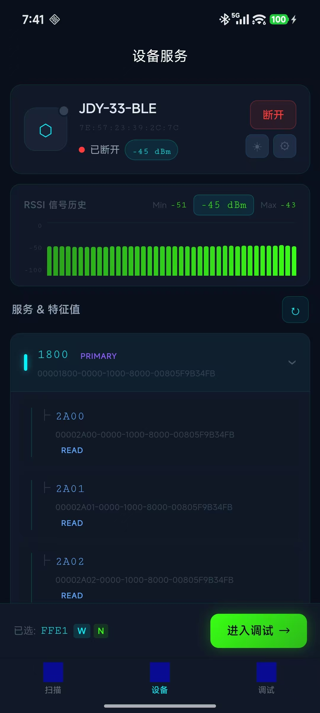
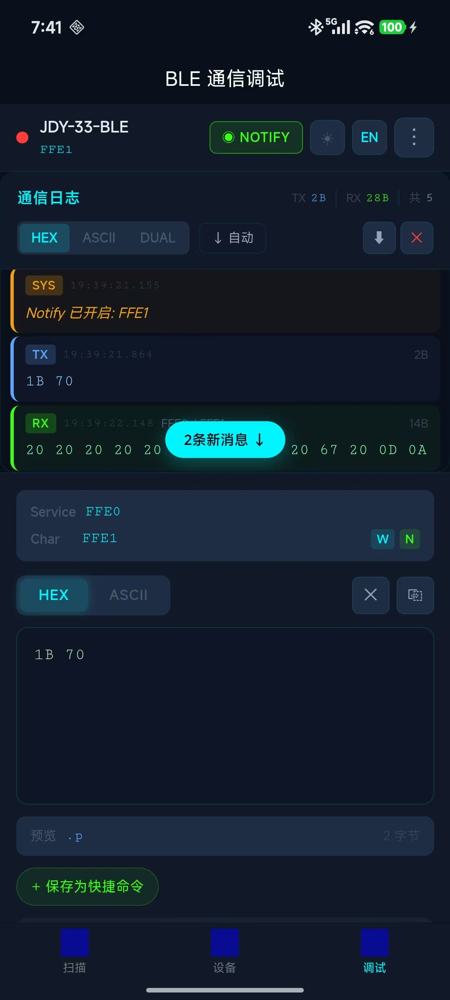

<div align="center">

# ⬡ BLE Debugger

**A professional Bluetooth Low Energy debugging tool for hardware engineers**

[](https://uniapp.dcloud.net.cn/)
[](https://www.typescriptlang.org/)
[](https://pinia.vuejs.org/)
[](https://uniapp.dcloud.net.cn/)
[](#)
[](#)

[中文文档](./README_Zh.md) · [Features](#features) · [Quick Start](#quick-start) · [Architecture](#architecture) · [Screenshots](#screenshots)

</div>

---

## Overview

**BLE Debugger** is a cross-platform (Android / iOS) Bluetooth Low Energy debugging assistant built with UniApp + Vue3. Designed for embedded engineers and hardware developers, it delivers a serial-tool-like experience for wireless debugging — complete with real-time HEX/ASCII communication, service tree inspection, notify subscriptions, quick command management, RSSI signal charts, MTU negotiation, characteristic value diff history, custom protocol plugin execution, multi-format log export, and **simultaneous multi-device debugging**.

The app ships with two display themes (Dark / Light) and full bilingual support (Chinese / English), switchable at any time without restarting.

<div style="display: flex; flex-wrap: wrap; gap: 10px; max-width: 420px;">
  
  
  
  
</div>

---

## Features

### Core BLE Capabilities
- **Device Scanning** — Real-time BLE advertisement discovery with radar animation; scanning stays active even while devices are connected
- **Smart Filtering** — Filter by device name or minimum RSSI threshold
- **Service & Characteristic Tree** — Multi-device tree view showing all connected devices' services and characteristics with property badges (READ / WRITE / WRITE NR / NOTIFY / INDICATE)
- **HEX / ASCII Communication** — Full duplex send & receive with format switching
- **Notify Subscriptions** — Toggle BLE notifications per characteristic
- **Read on Demand** — Trigger explicit characteristic reads
- **Auto-Reconnect** — Automatic reconnection with configurable heartbeat keep-alive
- **MTU Negotiation** — Negotiate MTU size (23–512 bytes) per device with real-time feedback
- **Multi-Device Simultaneous Debugging** — Connect and debug multiple BLE devices at the same time; each device has its own isolated log buffer, service tree, and communication state

### Developer Experience
- **Quick Commands** — Save frequently used payloads with custom names; long-press to delete
- **Communication Log** — Timestamped, color-coded TX/RX/SYS entries with 2000-entry ring buffer; fully isolated per connected device
- **Dual Display Mode** — View data in HEX, ASCII, or DUAL mode simultaneously
- **Log Export (TXT / CSV)** — Export session logs in plain text or spreadsheet-ready CSV format
- **Protocol Analysis** — Built-in RAW / UART parser; **custom JavaScript plugin system** for user-defined frame parsers
- **RSSI Signal Chart** — Live bar chart of received signal strength over time, polled every 2 s while connected
- **Characteristic Value Diff** — Per-characteristic history of received values with byte-level change highlighting
- **Recent Devices** — Quick reconnect from a persistent recent-device list

### UI / UX
- **Dark Theme** — High-contrast terminal aesthetic (`#0A0F1C` + `#00F5FF` cyan + `#39FF14` green)
- **Light Theme** — Professional daylight mode (`#EDF2F7` + `#0369A1` blue + `#059669` green)
- **Theme Toggle** — Instant switch via header buttons or Settings panel; preference persisted
- **Bilingual** — Full Chinese / English interface; instant switching, nav bar title synced
- **Responsive Layout** — Stacked on phones; side-by-side panel layout on tablets / landscape (≥768 px) with a fixed 60 px left sidebar replacing the bottom tab bar

---

## Screenshots

> _Dark theme on the left · Light theme on the right_

| Scan | Device Overview | Debug Console |
|------|----------------|---------------|
| Radar animation, RSSI bars, connected badges | Multi-device tree · MTU panel · RSSI chart | Device tabs · HEX/ASCII I/O · log panel · protocol parser |

---

## Tech Stack

| Layer | Technology |
|-------|-----------|
| Framework | UniApp (Vue 3 + `<script setup>`) |
| Language | TypeScript 5 |
| State Management | Pinia 2 — `bleStore` (sessions + adapter) · `appStore` (theme/locale) · `protocolStore` (plugins) |
| BLE API | UniApp native BLE APIs — Promise-wrapped, per-device state machine |
| Styling | Scoped SCSS + CSS Custom Properties (dual theme via `.theme-dark` / `.theme-light` classes) |
| Responsive Layout | `useResponsive` composable — `LeftTabBar` component for ≥768 px; native bottom tab bar for narrow screens |
| i18n | Custom `useI18n` composable (dot-notation keys, reactive locale switching) |
| Storage | `uni.setStorageSync` for settings, quick commands, plugins & device pins |

---

## Requirements

| Platform | Minimum Version |
|----------|----------------|
| Android | API 21 (Android 5.0) |
| iOS | iOS 13.0 |
| HBuilderX | 3.x+ |
| Node.js | 16+ (CLI mode) |

> **Bluetooth permissions** are declared automatically via `manifest.json`.
> On Android 12+, `BLUETOOTH_SCAN` and `BLUETOOTH_CONNECT` are requested at runtime.

---

## Quick Start

### Option A — HBuilderX (Recommended)

```bash
# 1. Clone the repository
git clone https://github.com/your-org/uniapp-ble-debugging-assistant.git
cd uniapp-ble-debugging-assistant

# 2. Install dependencies
npm install

# 3. Open in HBuilderX → Run → Run to Phone/Emulator
```

> Go to **Run → Run to Phone or Emulator → Run to Android/iOS** to build and deploy directly.

### Option B — CLI

```bash
npm install

# Development build (App-Plus)
npm run dev:app

# Production build
npm run build:app
```

---

## Project Structure

```
uniapp-ble-debugging-assistant/
│
├── pages/
│   ├── scan/index.vue          # Device scan page — finds devices, marks already-connected ones
│   ├── device/index.vue        # Multi-device tree overview — all sessions' services & characteristics
│   ├── debug/index.vue         # BLE debug console — DeviceTabBar + per-session log & send panel
│   └── protocol/index.vue      # Protocol plugin management (add / edit / enable)
│
├── components/
│   ├── DeviceTabBar.vue         # Horizontal tab bar for switching between connected device sessions
│   ├── DeviceItem.vue           # Scan list card (RSSI bars, connectable badge, connected indicator)
│   ├── BleLogPanel.vue          # Communication log viewer (per-session)
│   ├── HexInput.vue             # HEX/ASCII input + quick commands + send
│   ├── RadarScanAnimation.vue   # Animated radar with device dots
│   ├── RssiChart.vue            # Live RSSI bar chart (connected device signal history)
│   ├── DiffModal.vue            # Characteristic value history with byte-level diff highlight
│   ├── LeftTabBar.vue           # Fixed 60 px left sidebar for ≥768 px screens
│   └── SettingsPanel.vue        # Bottom-sheet: theme & language switcher
│
├── services/
│   └── bleManager.ts            # BLE abstraction layer
│                                #   Adapter state machine: UNINITIALIZED → IDLE ↔ SCANNING
│                                #   Per-device state: Map<deviceId, CONNECTING|CONNECTED|DISCONNECTED>
│                                #   + getRSSI(deviceId)  + negotiateMTU(deviceId, mtu)
│
├── store/
│   ├── bleStore.ts              # BLE runtime state
│   │                            #   sessions: Map<deviceId, DeviceSession>  ← isolated per device
│   │                            #   activeSessionId: string                  ← drives debug page
│   │                            #   + adapter state (scannedDevices, scanning, filters)
│   ├── appStore.ts              # App settings state (theme, locale, CSS variables)
│   └── protocolStore.ts         # Protocol plugin registry (add / run / persist)
│
├── composables/
│   ├── useI18n.ts               # i18n composable — t('dot.notation.key')
│   └── useResponsive.ts         # isWideScreen reactive flag (window.width ≥ 768 px)
│
├── locales/
│   ├── zh.ts                    # Simplified Chinese strings
│   └── en.ts                    # English strings
│
├── utils/
│   ├── hex.ts                   # HEX↔ArrayBuffer, ASCII, UUID, RSSI utilities
│   └── buffer.ts                # Log entries, ring buffer, TXT/CSV export, persistence
│
├── App.vue                      # Global CSS custom property definitions (both themes)
├── pages.json                   # Route configuration
└── manifest.json                # App permissions & platform config
```

---

## Architecture

### Data Flow

```
Hardware BLE Radio
  │
  ▼
uni BLE API callbacks (onBLECharacteristicValueChange, onBLEConnectionStateChange, ...)
  │
  ▼
bleManager  ── Promise-based API + event emitters ──▶  bleStore
  │                                                        │
  │  onDataReceived(deviceId, svcId, charId, value)        ├── sessions.get(deviceId).logBuffer
  │  onConnectionChange(deviceId, connected)               ├── sessions.get(deviceId).charValueHistory
  │  onAdapterStateChange(adapterState)                    └── adapterState (SCANNING / IDLE / ...)
  │
  ▼
Pages & Components  ←  reactive Pinia state (auto re-render)
```

### BLE Adapter State Machine

```
UNINITIALIZED ──openAdapter()──▶ IDLE ◀──▶ SCANNING
                                  │
                            (parallel, independent of scanning)
                                  ▼
                     Per-device: Map<deviceId, DeviceState>
                       CONNECTING → CONNECTED → DISCONNECTED
                                        ↑              │
                                        └──(reconnect)─┘
```

`bleManager.ts` owns both layers. Connecting a new device does **not** stop an active scan — scanning and connections are fully independent.

### Multi-Device Session Architecture

```
bleStore
  ├── sessions: Map<deviceId, DeviceSession>
  │     DeviceSession {
  │       device          BleDevice
  │       deviceState     BleDeviceState
  │       services        BleService[]
  │       characteristics Map<serviceId, BleCharacteristic[]>
  │       logBuffer       RingBuffer<LogEntry>   ← isolated, 2000 entries
  │       logs            LogEntry[]
  │       rssiHistory     { time, rssi }[]        ← isolated, 60 points
  │       charValueHistory Record<charId, { time, hex }[]>
  │       currentMtu      number
  │       txBytes / rxBytes number
  │       activeServiceId / activeCharacteristicId / notifyEnabled
  │     }
  │
  ├── activeSessionId: string       ← which tab is shown in debug page
  │
  └── Adapter-level (shared)
        adapterState, scannedDevices, filterName, filterMinRssi,
        quickCommands, recentDevices, isConnecting, errorMessage
```

**Active session proxy** — all debug page computed properties (`isConnected`, `logs`, `services`, `activeCharacteristic`, …) read from `sessions.get(activeSessionId)`. Switching tabs by changing `activeSessionId` instantly reflects a different device's state with zero re-initialization.

### Theme System

CSS custom properties are declared in `App.vue` under `.theme-dark` and `.theme-light` classes. Each page root element applies `:class="appStore.themeClass"`, making all scoped child component styles automatically inherit the active theme via `var(--xxx)`.

```
App.vue (defines .theme-dark / .theme-light vars)
  └── page root <view :class="appStore.themeClass">
        └── child components → var(--bg-base), var(--color-primary), ...
```

`appStore` also exports `cssVarsStyle` (inline style string) for components that need direct variable injection.

### Responsive Layout Architecture

```
useResponsive() composable
  └── isWideScreen: boolean  (window.width ≥ 768 px, reactive via ResizeObserver / onLoad)

Narrow (<768 px)                    Wide (≥768 px)
─────────────────                   ──────────────────────────────────
Native bottom TabBar                LeftTabBar.vue (60 px fixed sidebar)
Single-column layout                Two-column flex layout (page-specific ratios)

Page split ratios (wide):
  Scan page:    40% left (radar + controls)   /  60% right (device list)
  Device page:  35% left (info + MTU + RSSI)  /  65% right (service tree)
  Debug page:   55% left (log panel)          /  45% right (send panel)
```

Each tab page conditionally renders `<LeftTabBar v-if="isWideScreen" />` and applies `padding-left: 60px` so content clears the sidebar.

### i18n System

```ts
// composables/useI18n.ts
const { t } = useI18n()
t('scan.startScan')   // → 'Start Scan'  |  '开始扫描'
t('debug.bytes')      // → 'bytes'       |  '字节'
```

Switching `appStore.locale` between `'zh'` and `'en'` is reactive and updates all `t()` calls instantly. Nav bar titles are synced via `watch`.

### Protocol Plugin System

Plugins are plain JavaScript function bodies stored in `uni.setStorageSync`. Each plugin receives `hexStr` and `asciiStr` as arguments and must return `{ fields: [{ name, value }] }`.

```js
// Example plugin — parse a 4-byte custom frame
const b = hexStr.split(' ').map(h => parseInt(h, 16));
return {
  fields: [
    { name: 'CMD',     value: '0x' + b[0].toString(16).toUpperCase() },
    { name: 'Length',  value: b[1] + ' bytes' },
    { name: 'Payload', value: hexStr.slice(6) },
    { name: 'CRC',     value: '0x' + b[b.length - 1].toString(16).toUpperCase() },
  ]
};
```

Plugins are executed via `new Function()` in `protocolStore.runPlugin()`. Only one plugin can be enabled at a time.

---

## Key Files Reference

### `services/bleManager.ts`

| Method | Description |
|--------|-------------|
| `openAdapter()` | Open Bluetooth adapter; sets up state & device listeners |
| `startScan(options?)` | Start BLE scan with optional timeout; safe to call while devices are connected |
| `stopScan()` | Stop BLE scan |
| `connect(deviceId)` | Establish BLE connection (does not stop ongoing scan) |
| `disconnect(deviceId)` | Destroy BLE connection for a specific device |
| `getServices(deviceId)` | Retrieve all services |
| `getCharacteristics(deviceId, serviceId)` | Retrieve characteristics |
| `write(deviceId, serviceId, charId, buffer)` | Write data to characteristic |
| `readCharacteristic(deviceId, serviceId, charId)` | Read characteristic value |
| `setNotify(deviceId, serviceId, charId, enable)` | Toggle BLE notifications |
| `getRSSI(deviceId)` | Query current RSSI of connected device |
| `negotiateMTU(deviceId, mtu)` | Request MTU negotiation (23–512); returns actual MTU |
| `getConnectedDeviceIds()` | Returns `Set<string>` of all currently connected device IDs |
| `getDeviceState(deviceId)` | Returns per-device connection state |
| `onAdapterStateChange(fn)` | Subscribe to adapter state changes (UNINITIALIZED / IDLE / SCANNING) |
| `onDeviceStateChange(fn)` | Subscribe to per-device state changes |
| `onDataReceived(fn)` | Subscribe to incoming characteristic data |

### `utils/hex.ts`

| Function | Description |
|----------|-------------|
| `bufToHex(buf)` | `ArrayBuffer → "01 AB FF"` |
| `hexToBuf(str)` | `"01ABFF" → ArrayBuffer` |
| `bufToAscii(buf)` | Binary → printable ASCII (`.` for non-printable) |
| `isValidHex(str)` | Validate HEX string format |
| `normalizeHex(str)` | Format HEX with spaces |
| `shortUUID(uuid)` | Shorten UUID to `0xXXXX` form |
| `rssiToLevel(rssi)` | RSSI → signal bar level (1–5) |
| `rssiToColor(rssi)` | RSSI → color string |

### `utils/buffer.ts`

| Function | Description |
|----------|-------------|
| `exportLogsToText(logs, device)` | Serialize log array as formatted plain text |
| `exportLogsToCSV(logs, device)` | Serialize log array as RFC-4180 CSV |
| `saveLogsToFile(content, filename, mimeType)` | Write file to local storage (App) or trigger download (H5) |

---

## Theme Color Reference

### Dark Mode (Default)

| Token | Value | Usage |
|-------|-------|-------|
| `--bg-base` | `#0A0F1C` | Page background |
| `--bg-panel` | `#111827` | Cards, headers |
| `--color-primary` | `#00F5FF` | Cyan — primary actions, borders |
| `--color-accent` | `#39FF14` | Green — RX data, success states |
| `--color-danger` | `#FF3B3B` | Errors, disconnect |
| `--text-primary` | `#E2E8F0` | Main body text |
| `--text-mono` | `#A8D8A8` | Monospace data display |

### Light Mode

| Token | Value | Usage |
|-------|-------|-------|
| `--bg-base` | `#EDF2F7` | Page background |
| `--bg-panel` | `#FFFFFF` | Cards, headers |
| `--color-primary` | `#0369A1` | Deep blue — primary actions |
| `--color-accent` | `#059669` | Emerald — RX data, success |
| `--color-danger` | `#DC2626` | Errors, disconnect |
| `--text-primary` | `#1A202C` | Main body text |
| `--text-mono` | `#1A5F2E` | Monospace data display |

---

## Settings & Persistence

| Setting | Storage Key | Default |
|---------|-------------|---------|
| Theme | `ble_app_theme` | `dark` |
| Language | `ble_app_locale` | `zh` |
| Quick Commands | `ble_quick_commands` | `[]` |
| Recent Devices | `ble_recent_devices` | `[]` |
| Protocol Plugins | `ble_protocol_plugins` | `[]` |

All settings survive app restarts via `uni.setStorageSync`.

---

## Permissions

### Android

| Permission | Purpose |
|------------|---------|
| `BLUETOOTH` / `BLUETOOTH_ADMIN` | Basic Bluetooth control (API < 31) |
| `BLUETOOTH_SCAN` | BLE device scanning (API 31+) |
| `BLUETOOTH_CONNECT` | BLE device connection (API 31+) |
| `ACCESS_FINE_LOCATION` | Required for BLE scanning |
| `WRITE_EXTERNAL_STORAGE` | Log file export |

### iOS

| Permission | Purpose |
|------------|---------|
| `NSBluetoothAlwaysUsageDescription` | BLE scanning and connection |
| `NSBluetoothPeripheralUsageDescription` | Peripheral data communication |
| `NSLocationWhenInUseUsageDescription` | BLE scanning location requirement |

---

## Contributing

1. Fork the repository
2. Create a feature branch: `git checkout -b feature/my-feature`
3. Commit your changes: `git commit -m 'feat: add my feature'`
4. Push and open a Pull Request

Please follow the existing TypeScript + Vue3 Composition API style. All UI text must be added to both `locales/zh.ts` and `locales/en.ts`.

---

## License

MIT © 2024 BLE Debugger Contributors

---

<div align="center">
<sub>Built with UniApp · Vue 3 · TypeScript · Pinia</sub><br/>
<sub>Designed for hardware engineers who demand professional tools</sub>
</div>
