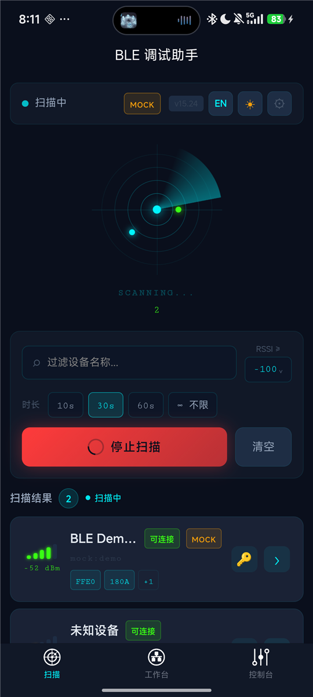
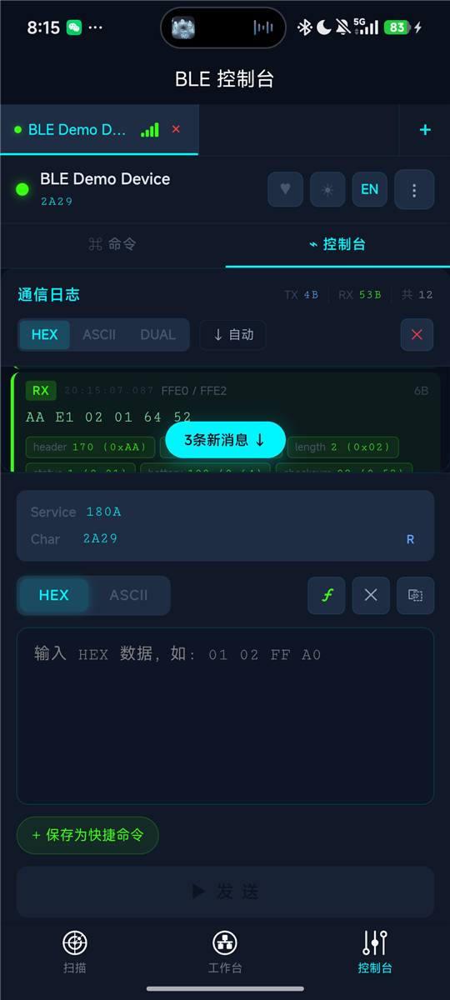
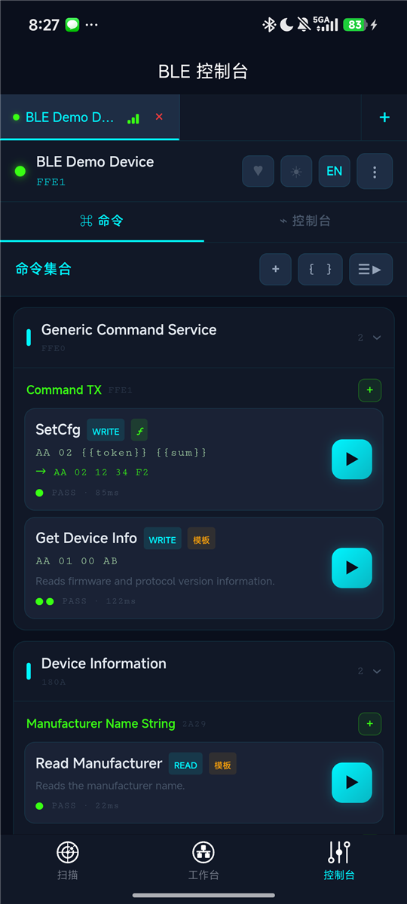
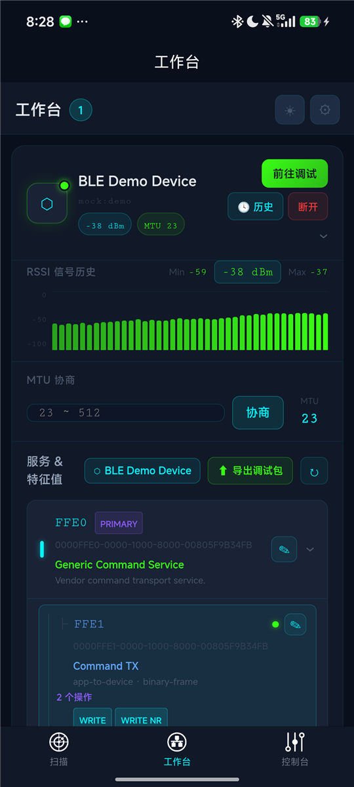
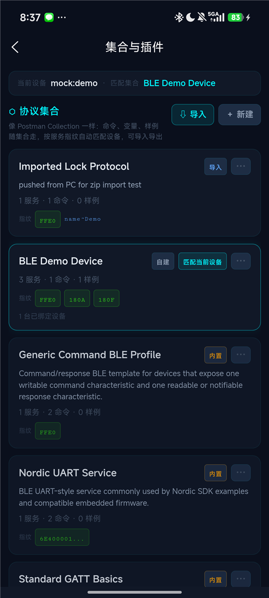

# BLE 调试助手 使用说明书

适用版本 0.2.0 · 更新于 2026-09-02

[English version](./USER_GUIDE.md)

从连接设备、发送第一条命令，到整理协议、批量验证和分享调试包。本说明书使用内置 **BLE Demo Device** 演示，首次使用可直接从第 2 节开始。

> 截图来自 Android 真机（HBuilderX 标准基座），用于识别主要页面。截图中的版本标签和演示数据可能与当前版本不同，具体操作以本文及当前界面为准。

## 目录

1. [这是什么](#1-这是什么)
2. [快速开始](#2-快速开始)
3. [界面导览](#3-界面导览)
4. [扫描与连接](#4-扫描与连接)
5. [控制台](#5-控制台)
6. [命令集合](#6-命令集合)
7. [载荷模板与变量](#7-载荷模板与变量)
8. [字段类型与断言](#8-字段类型与断言)
9. [工作台与导出调试包](#9-工作台与导出调试包)
10. [协议集合](#10-协议集合)
11. [Mock 模式](#11-mock-模式)
12. [心跳测试与传输历史](#12-心跳测试与传输历史)
13. [设置](#13-设置)
14. [常见问题](#14-常见问题)

---

## 1. 这是什么

BLE 调试助手面向蓝牙低功耗设备的开发和联调，将收发记录、协议说明和可执行命令放在同一套工作流程里。

| 你要完成的工作 | 对应能力 |
|---|---|
| 找到设备并验证链路 | 扫描、连接、服务发现、HEX / ASCII 收发、READ、Notify、RSSI、MTU |
| 重复验证一条协议命令 | 保存命令、配置期望响应和字段断言，查看 PASS / FAIL / 超时和 RTT |
| 调试同型号的多台设备 | 多设备会话、集合匹配、每台设备的变量覆盖 |
| 整理和分享协议 | 接口注释、请求 / 响应字段表、配对样例、集合导入导出 |
| 没有硬件时演练 | 内置演示设备、根据集合生成的 Mock 设备 |
| 请同事或 AI 分析问题 | 导出 Debug Pack，包含所选协议文档、记录、分析上下文和 Mock 数据 |

建议的工作顺序：**连接 → 确认端点 → 收发验证 → 保存命令 → 添加断言 → 保存样例 → 导出或复用集合**。

## 2. 快速开始

### 2.1 运行与准备

已有可运行 App 时，直接打开即可。使用项目源码时，在 **HBuilderX** 中导入项目，连接手机，选择「运行 → 运行到手机或模拟器」，再选择目标设备。调试真实 BLE 外设时使用具备蓝牙能力的真机。

首次进入扫描页，按系统提示授予蓝牙 / 附近设备及定位等所需权限，并开启手机蓝牙。真实设备应处于可发现、可连接状态；只练习操作时可先使用 Mock。

| 运行环境 | 本说明书中的使用方式 |
|---|---|
| Android App | 真实 BLE 或 Mock；可选择 JSON / ZIP 文件导入；调试包可打包并调起系统分享 |
| iOS App | 项目提供 BLE 和 Mock 路径；集合使用粘贴 / 剪贴板导入，当前没有 App 内文件选择器；本文配图来自 Android |
| H5 浏览器 | 用 Mock 走通界面与协议流程；当前项目未接入 Web Bluetooth；导出时逐个下载文件 |

### 2.2 没有硬件：连接演示设备

1. 在扫描页空态下点击「没有硬件？连接演示设备」，开启 Mock 并开始扫描。
2. 列表已有设备、看不到演示入口时，打开设置，启用「演示 / Mock 模式」，再扫描。
3. 找到带 **MOCK** 标记的 **BLE Demo Device**，点击连接。连接后进入控制台。
4. 切换到「命令」，找到 **Generic Command Service → Command TX → Get Device Info**，点击右侧 ▶。
5. 查看执行结果，切回「控制台」检查 TX / RX。首次执行可能需要先发现特征值并订阅响应端点。

这条演示命令的参数如下，完整 UUID 可在工作台服务树中查看：

| 项目 | 演示值 |
|---|---|
| 服务 / 写入特征值 | `FFE0` / `FFE1` |
| 动作 / 请求 | WRITE / `AA 01 00 AB` |
| 响应特征值 | `FFE2`（Notify） |
| 设备信息响应 | `AA 81 03 01 00 10 39` |
| 正常结果 | 命令显示 PASS 和 RTT；日志有对应 TX 和 RX |

> 这些字节只用于内置演示协议。内置模板按 UUID 匹配，真实设备使用相同 UUID 也可能采用不同帧格式，发送前应按设备协议修改载荷和响应条件。

### 2.3 完成一次调试闭环

1. 执行上面的查询，确认链路和应答。
2. 长按内置命令选择复制，再长按副本进入编辑，将响应前缀细化为 `AA 81`，超时设为 `2000` ms，保存并执行副本。
3. 长按成功执行的命令，选择「保存最近执行为样例」，保存本次请求和响应。
4. 到工作台展开设备，确认服务树和集合名称；点击「导出调试包」，勾选接口文档、传输记录及需要的其他文档。
5. 填写调试目标并导出。在另一台手机的「集合与插件」中导入包内的 `collection.json`，或直接选择调试包 ZIP。

完成后，你应有一条可重复执行的命令、一份配对样例和一份可导出的协议资产。

## 3. 界面导览

底部有三个主入口，宽屏（平板、横屏、宽度 ≥768px）使用固定侧边导航和多栏布局。

| 入口 | 主要任务 | 常用下一步 |
|---|---|---|
| **扫描** | 找设备、过滤、连接、最近连接、启用演示 | 连接后进入控制台 |
| **工作台** | 查看设备、RSSI、MTU、服务树、接口注释和集合 | 选择特征值调试，或导出调试包 |
| **控制台** | 命令执行、实时日志、手动发送、协议解析、心跳 | 保存命令 / 样例，查看判定和问题原因 |

手机控制台包含「命令」和「控制台」两个内部页签，两者属于同一个已连接设备。顶部设备栏可切换多台设备，发送前核对当前设备和特征值。

| 名词 | 在本 App 中的含义 |
|---|---|
| 服务（Service） | 一组相关特征值的容器，用 UUID 标识 |
| 特征值（Characteristic） / 端点 | 实际读、写或订阅的入口，由服务 UUID + 特征值 UUID 定位 |
| 命令（Operation） | 保存的目标、动作、载荷、响应条件和文档 |
| 协议集合（Collection） | 可跨设备复用的命令、注释、变量、样例和拓扑 |
| 样例（Example） | 保存的一段通信，可含成对的请求和响应 |
| RTT | 从请求到匹配响应的往返耗时，单位 ms |

## 4. 扫描与连接



### 4.1 扫描设备

1. 输入设备名的一部分，或先留空查看全部结果。
2. 设置最小 RSSI 和扫描时长（10s / 30s / 60s / 不限），点击开始扫描。
3. 通过名称、设备 ID、广播服务 UUID 和 MOCK 标记辨认设备，再点击设备卡片连接。
4. 需要添加设备时返回扫描页，可以保持现有连接并继续扫描。

RSSI 数值越接近 0，接收信号通常越强，例如 `-50 dBm` 比 `-90 dBm` 强。提高门槛会隐藏弱信号设备，找不到目标时先放宽过滤。广播中的服务标签用于初步识别，完整服务与特征值在连接后查看。

「停止扫描」结束发现过程；「清空」清除扫描结果列表。最近连接用于一键重连，旁边的历史入口可查看传输会话。重连失败时重新扫描，确认设备仍使用原来的标识并允许连接。

### 4.2 PIN 配置

设备卡片的钥匙按钮可保存 PIN、编码方式及目标服务 / 特征值。配置自动发送后，App 会在连接成功后把 PIN 写入指定端点；未配置自动发送时按提示手动发送。

这里保存的是设备协议所需的认证载荷。系统蓝牙配对弹窗仍由操作系统和设备决定，App 的 PIN 写入不能替代所有系统配对流程。

### 4.3 连接后先确认什么

- 顶部设备名是否正确，是否带 MOCK 标记。
- 到工作台展开服务树，确认可写端点和接收端点的 UUID、属性。
- 接收端点是否需要开启 Notify，设备是否要求先认证。
- 多设备切换时核对各自的命令、变量覆盖和日志；结束后可单独断开某台设备。

## 5. 控制台



### 5.1 选择端点与第一次手动收发

从工作台展开服务，选择目标特征值进入调试。发送区显示当前 Service / Char 和属性，选错时先返回工作台更换端点。

| 属性 / 动作 | 如何使用 |
|---|---|
| READ | 主动读取一次当前值，结果作为 RX 进入日志 |
| WRITE | 使用有写入响应的方式发送；业务是否成功仍需查看设备响应 |
| WRITE NR | 无写入响应方式，目标必须支持；同样可另行配置业务应答判定 |
| NOTIFY / INDICATE | 订阅设备主动上报；手动收发时先在接收端点开启通知 |

以演示设备为例：先在 `FFE0 / FFE2` 开启 Notify，再选 `FFE0 / FFE1`，切到 HEX，输入 `AA 01 00 AB` 并发送。日志应出现 TX 和以 `AA 81` 开头的 RX。执行带期望响应的命令时，App 会尝试自动开启指定响应端点的通知。

### 5.2 阅读通信日志

- **TX / RX / SYS**：发送、接收和系统事件；每条记录带时间、端点及字节数。
- **HEX / ASCII / DUAL**：十六进制、文本或两种内容同时显示；二进制协议优先查看 HEX。
- **自动滚动**：开启后跟随新数据；关闭后可查看旧记录，使用新消息提示返回底部。
- **字段值标签**：有字段表时显示 `字段=值`。命令的请求 / 响应字段表及特征值文档参与解码。
- **心跳过滤**：有心跳记录时可通过 ♥ 控制是否显示心跳收发。

长按 TX 可保存单条协议样例、配对保存为样例，或由日志生成命令；长按 RX 可保存接收样例。自动配对寻找 2 秒内的响应，保存后应核对是否混入周期上报。带期望响应的命令执行记录通常更适合保存明确的请求 / 响应对。

### 5.3 发送区与快捷命令

HEX 按字节填写，例如 `01 02 FF A0`。输入控件会过滤非法字符，发送前仍需核对最终内容和字节数。ASCII 用于文本协议。HEX 模板会显示渲染结果，未定义变量或错误格式会提示并阻止发送。

工具栏 **ƒ** 可插入占位符，语法见第 7 节。快捷命令点击后填入发送区；「保存为快捷命令」保存当前内容。需要保存目标端点、期望响应和执行记录时，使用第 6 节的命令集合。

### 5.4 其他入口

顶部可开启心跳、切换语言 / 主题；更多菜单提供读取特征值、特征值历史（值 Diff）、清空日志、设置和断开等操作。Notify 开关是否显示取决于当前特征值属性。

「协议解析」使用 RAW、UART 或自定义 JS 插件解析最近一条 RX。集合字段表驱动日志解码和断言；自定义插件的解析结果显示在此区域，配置见第 10.5 节。

## 6. 命令集合



### 6.1 命令来源

- **内置模板**：按服务 UUID 匹配 Generic Command、Nordic UART、Standard GATT 等模板，带「模板」标记；可执行模板命令默认配置期望响应。`request: NONE` 的事件接口不会显示成可执行命令。
- **自建命令**：点击面板或特征值行的「＋」，也可导入快捷命令或由 TX 日志生成。
- **协议集合**：命令跟随集合复用，同型号设备匹配或绑定集合后可以使用。

内置命令是协议起点。操作真实设备时应确认请求格式、响应端点和字段含义，而不只看服务 UUID 是否相同。

### 6.2 新建或编辑命令

1. 点「＋」，或长按自建命令选择编辑，填写名称和 Operation ID（如 `device.getInfo`）。内置模板命令需先复制，再编辑副本。
2. 选择服务 / 目标特征值和动作 WRITE、WRITE NR 或 READ。刚连接时等待特征值发现完成。
3. 写命令选择 HEX / ASCII，填写载荷；READ 无需载荷。模板下方显示渲染后的 HEX。
4. 开启「校验期望响应」，指定响应特征值、HEX 前缀和超时。前缀应能区分业务响应与周期事件。
5. 验证字段时补充响应字段表和断言；多组输入可填写载荷变体。
6. 文档字段中整理请求 / 响应说明、帧样例、字段表和 Mock 规则，保存后用 ▶ 验证。

「从已存样例填入」可复用协议样例或集合样例。Operation ID 用于命令与模板的对应及导出，修改显示名称时通常可保留原 ID。

### 6.3 执行方式与结果

普通模式下，点击卡片填入发送区，点击 ▶ 立即执行，点击载荷变体按该变体执行；长按打开编辑、复制、删除、保存最近执行为样例等菜单。

| 结果 | 表示什么 | 下一步 |
|---|---|---|
| PASS | 找到符合端点 / 前缀条件的响应，配置的断言全部通过 | 查看 RX 与 RTT，按需保存样例 |
| FAIL | 匹配到响应，但字段 / 偏移断言不满足 | 核对字段类型、偏移和预期值 |
| 超时 | 超时前未收到满足匹配条件的响应 | 检查 Notify、端点、前缀和设备状态 |
| 错误 | 不可写、断连、载荷渲染失败或设备忙等执行错误 | 根据提示修正后重试 |
| 已发送 | 未启用期望响应校验，该动作已完成 | 需业务成功判定时开启期望响应和断言 |

不符合响应前缀的 RX 会出现在日志中，但不会立刻判为 FAIL，App 会继续等待匹配或超时。内置模板的默认前缀可能只匹配首字节，正式验证应细化匹配并补充断言。PASS 的范围取决于你配置了哪些检查。

每台设备的每条命令保留最近 10 次执行记录，面板以结果圆点和 RTT 展示，导出的 `SESSION_LOG.md` 可包含 Operation Runs。

### 6.4 变量与环境

工具栏 **{ }** 打开变量面板。集合变量用于共享默认参数，设备覆盖用于当前手机上某台设备的不同取值，优先级为 **设备覆盖 > 集合变量**。面板显示当前会话序号并支持重置。

例如 `token = 12 34`，载荷 `AA 02 {{token}} {{sum}}` 渲染为 `AA 02 12 34 F2`。另一台设备可用本机覆盖值，无需修改共享集合。

### 6.5 顺序执行（Runner）

1. 点击工具栏 ☰▶ 进入选择模式，勾选命令。
2. 打开 ⚙ 设置选项，确认目标设备与每条命令的响应条件。
3. 点击「运行 N 条」，等待报告，查看每一步 TX、RX、RTT 和结果。

| 选项 | 含义 / 初始默认值 |
|---|---|
| 步间延时 | 步骤之间等待，默认 200 ms |
| 循环次数 | 重复执行所选命令，默认 1 次 |
| 失败即停 | 遇到 FAIL / 超时 / 错误时停止，默认关闭 |
| 展开变体 | 有变体的命令按各变体分别运行，默认关闭 |

顺序按面板中的命令排列，勾选先后不会改变顺序；展开变体增加实际步骤数。报告显示汇总、平均 RTT，未完成计划步骤时标明中止。选项会保存供下次使用。

> Runner 的成功汇总也包含「已发送」。需要比较响应通过率时，让参与验证的命令都开启期望响应，并逐步查看报告结果。

### 6.6 保存样例

成功执行后长按命令，选择「保存最近执行为样例」，把请求 / 响应保存到集合。手动收发也可从 TX 配对保存。详情页可重命名、编辑备注或删除样例。

样例用于编辑器填入、导出和 Mock 规则生成，可在备注中注明固件版本、参数条件和预期现象。

## 7. 载荷模板与变量

### 7.1 HEX 模板速查

在 HEX 中插入 `{{...}}`。长度按最终字节数计算，校验类占位符从左到右计算，只覆盖它前面的字节，通常放在帧尾。

| 占位符 | 含义 | 示例或注意事项 |
|---|---|---|
| `{{len}}` | 整帧字节数，默认 1 字节 | `AA 01 {{len}} {{sum}}` → `AA 01 04 AF` |
| `{{len:-2}}` / `{{len:+1}}` | 整帧长度加减常量 | 需按协议扣除帧头等字节，不自动识别载荷长度 |
| `{{len:u16le}}` / `{{len:-2:u16be}}` | 两字节长度，小端 / 大端 | 长度字段自身也计入总长 |
| `{{seq}}` / `{{seq:u16le}}` | 当前会话序号 | 默认取低 8 位，两字节需显式指定类型 |
| `{{sum}}` / `{{sum:1}}` | 累加和低 8 位 | `:1` 表示从偏移 1 开始，偏移从 0 计数 |
| `{{xor}}` / `{{xor:1}}` | 异或校验 | 可指定起始偏移 |
| `{{crc8}}` | CRC-8 | poly `0x07`，init `0x00` |
| `{{crc16}}` / `{{crc16:0:be}}` | CRC-16/MODBUS | 默认小端，第二种从偏移 0 计算并按大端输出 |
| `{{crc16ccitt}}` | CRC-16/CCITT-FALSE | 默认大端，poly `0x1021`，init `0xFFFF` |
| `{{name}}` | 变量按 HEX 字节串插入 | `token = 12 34` → `12 34` |
| `{{name:u16le}}` | 变量按数值类型编码 | `addr = 258` 或 `0x102` → `02 01` |
| `{{name:ascii}}` | 变量按文本编码 | `tag = OK` → `4F 4B` |
| `{{name:4}}` | 原始字节变量固定为 4 字节 | 不足补零，超出截断，先核对预览 |

### 7.2 一个可以复现的模板例子

1. 在变量面板保存 `token`，值为 `12 34`。
2. 新建演示命令，目标 `FFE0 / FFE1`，动作 WRITE，HEX 载荷 `AA 02 {{token}} {{sum}}`。
3. 预览应为 `AA 02 12 34 F2`，前四字节之和的低 8 位是 `F2`。
4. 开启期望响应，端点 `FFE2`，前缀 `AA 82`，超时 `2000` ms。
5. 执行后，内置演示设备返回 `AA 82 01 00 2D`，符合条件时显示 PASS。

此例练习模板与响应匹配。Mock 按请求前缀应答，不能据此证明真实协议的长度或校验算法正确。

### 7.3 序号、ASCII 与常见错误

`{{seq}}` 按设备会话保存，初始为 0，预览不消耗序号。发送路径渲染含 seq 的载荷时消耗序号，后续写入失败也可能出现跳号。新连接会话从 0 开始，可在变量面板重置。

ASCII 模式替换 `{{变量名}}`，支持 `{{seq}}` 的十进制文本，不计算 HEX 模式的长度、校验或类型编码。未知变量会原样保留在文本中，发送前应检查输入。

| 提示 / 现象 | 处理方法 |
|---|---|
| `unknown token` | 检查变量是否保存、名称大小写、当前设备环境 |
| `variable … is not hex` | 原始变量须为完整 HEX；数值或文本使用 `:u16le`、`:ascii` 等类型 |
| `invalid hex` | 核对占位符外的非法字符和不完整字节 |
| 校验不符合协议 | 核对算法、覆盖范围、输出字节序和长度偏移，与设备协议已知帧比较 |

## 8. 字段类型与断言

### 8.1 填写字段表

在命令编辑器文档字段中填写请求 / 响应字段表：**偏移、长度、类型、名称、含义**。偏移从第 0 字节开始；名称供解码和断言引用，应稳定且可区分。

| 类型 | 说明 |
|---|---|
| `u8` / `i8` | 无符号 / 有符号 8 位整数 |
| `u16le` / `u16be` / `i16le` / `i16be` | 16 位整数，小端 / 大端 |
| `u24le` / `u24be` | 无符号 24 位整数 |
| `u32le` / `u32be` / `i32le` / `i32be` | 32 位整数 |
| `f32le` / `f32be` | IEEE 754 单精度浮点数 |
| `bool` / `bitmask` / `bcd` | 布尔值（非零为 true）、位掩码、BCD 码 |
| `bytes` | 原始字节，HEX 显示 |
| `ascii` / `utf8` | 文本，长度写 `n` 可读到帧尾 |

类型可选择或手填，`uint8`、`u16 LE`、`int16BE`、`float`、`string`、`utf-8`、`hex` 等会被规范化。字段类型参与解码、类型化变量编码和断言；缺少字节时日志字段可能显示 `∅`。

### 8.2 用演示响应添加断言

设备信息响应 `AA 81 03 01 00 10 39` 可检查以下字段：

| 字段名称 | 偏移 | 长度 | 类型 | 本例解码值 | 断言示例 |
|---|---|---|---|---|---|
| `command` | 1 | 1 | `u8` | `129`（`0x81`） | `== 0x81` |
| `fwMajor` | 3 | 1 | `u8` | `1` | `>= 1` |
| `proto` | 5 | 1 | `u8` | `16`（`0x10`） | `== 0x10` |

保存响应字段表后，在「校验期望响应」中添加字段断言。演示时将 `fwMajor` 改为 `>= 2` 再执行，会在匹配到响应后得到 FAIL；改回 `>= 1` 可恢复通过。也可直接配置「偏移 1 的字节等于 `81`」的偏移断言。

### 8.3 比较规则

数值支持 `==`、`!=`、`>`、`>=`、`<`、`<=`、`in`（如 `1,2,3`）和 `range`（如 `1..10`，包含两端），预期值可写十进制或 `0x` 十六进制。文本 / 字节支持 `==`、`!=`、`in`。

失败原因包含实际值或缺失原因。只填字段表不会自动验证各字段，也不会自动校验 CRC，需要验证的条件须配置为断言。

## 9. 工作台与导出调试包



### 9.1 查看设备与整理接口

设备卡片提供「前往调试」「历史」「断开」，展开后有 RSSI 趋势、MTU 协商和服务树。MTU 以协商返回的实际值为准，设备或平台可能不接受请求值。

服务 / 特征值显示 UUID、属性以及匹配到的名称、方向、格式和操作数。点击 ✎ 编辑服务说明或接口文档。集合标签显示当前匹配集合，点击可进入集合与插件、复制 JSON 或解除显式绑定。

### 9.2 导出步骤

1. 在要导出的设备卡片点击「导出调试包」，当前入口以该设备为范围。
2. 选择用途：AI 分析、Mock 测试、团队复现或归档。
3. 勾选文档，至少选择一项。用途表达调试目的，实际内容由文档勾选决定。
4. 选择是否包含原始日志、是否脱敏设备 ID，填写目标或问题描述。
5. 确认导出。Android / iOS App 尝试生成 ZIP 并唤起系统分享；未唤起时查看保存路径，打包失败时查看文件夹提示。H5 逐个下载文件，需允许浏览器连续下载。

调试目标示例：「设备信息查询在连续执行时偶发超时；预期每次收到 AA 81 响应，请比较成功与超时前后的收发，检查响应前缀、Notify 和序号是否合理。」

### 9.3 文件与勾选项

| 文件 | 何时生成 / 用途 |
|---|---|
| `README.md` | 包索引，列出实际生成的文件 |
| `PROTOCOL.md` / `protocol.json` | 勾选接口文档：人读和结构化的服务、特征值、命令、字段说明等 |
| `collection.json` | 勾选接口文档且设备已匹配集合时生成，可导回 App |
| `SESSION_LOG.md` | 勾选传输记录：会话摘要、心跳统计、端点流量、执行记录；包含原始日志时附时间线 |
| `logs.csv` | 同时勾选传输记录和原始日志时生成 |
| `AI_PROMPT.md` | 勾选 AI 上下文：目标、上下文与输出要求 |
| `mock.json` | 勾选 Mock 数据：种子、变量、样例和可生成的规则 |

需要可导回的文件时，先确认集合存在并勾选接口文档。取消原始日志不会自动去掉样例、命令载荷或变量；「脱敏设备 ID」不会识别业务载荷中的口令和标识，分享前可按实际内容检查文件。

### 9.4 AI 补全后导回

把调试包和目标交给 AI，请其在原 `collection.json` 结构内补全名称、命令、字段表、变量和样例，并保留原有标识。回传后，在「集合与插件」导入并检查预览。

首次验证可新建集合；回写现有集合时选择合并目标及策略。「保留本地」用于补缺，不替换已有非空内容；确实要更新旧值时才选择覆盖。检查端点、载荷和断言，先用 Mock 或已知查询验证。

## 10. 协议集合



### 10.1 匹配与绑定

集合保存接口注释、命令、变量、样例和拓扑快照，与单台设备的连接实例分离，供同型号设备共享协议。

- **指纹匹配**：集合记录的服务 UUID 必须全部包含在设备服务中，更具体的服务指纹得分更高；可附加设备名子串或 `/正则/` 规则。
- **显式绑定**：优先于自动匹配，同一设备只能显式绑定一个集合。
- **自动创建**：首次保存注释或命令时，没有可编辑集合则创建并绑定。
- **拓扑快照**：已发现的服务、特征值及属性，供导出和 Mock 使用。

解除显式绑定后仍会按指纹匹配，因此标签可能继续显示同一集合。需要其他协议时，直接把正确集合绑定到当前设备。

### 10.2 管理集合与详情

从工作台集合入口进入「集合与插件」。卡片显示来源（自建 / 导入 / 内置）、匹配 / 已绑定标记、数量统计、指纹和名称规则。

点击卡片进入详情；「⋯」或长按提供复制 JSON、分享 JSON、编辑信息、绑定 / 解绑、作为 Mock 设备连接、复制和删除等操作。内置集合只读，编辑前先复制为可编辑集合。

详情页可查看指纹、已绑定设备和拓扑；变量编辑后保存；命令点击进入编辑器，删除按钮移除命令；样例菜单可重命名、编辑备注和删除。修改的是共享集合内容，匹配该集合的其他设备也会使用更新后的定义。

### 10.3 导入 JSON 或 ZIP

1. 点击「导入」，粘贴 JSON、读取剪贴板，或选择文件。
2. 选择 `.json` 或 Debug Pack `.zip`；ZIP 按优先级寻找 `collection.json`、`protocol.json`、`debug-pack.json`。
3. 查看预览，核对名称、服务、命令和样例数量。
4. 选择新建或合并到已有可编辑集合，合并策略为「保留本地（只补空缺）」或「以导入内容覆盖」。
5. 需要马上使用时勾选绑定当前设备，确认后到集合详情检查。

支持原生集合、`protocol.json`（0.1 / 0.2 / 0.3 格式）、Debug Pack JSON 和旧版注释。文件须为完整 JSON，粘贴 AI 输出时去掉外围说明和 Markdown 代码围栏。独立 `mock.json` 不是这里的集合导入入口。

Android 和 H5 可选择文件，iOS 使用粘贴 / 剪贴板。ZIP 无法读取时先解压，再导入其中的 `collection.json`。

### 10.4 换手机或分享

分享集合 JSON 或含它的调试包，对方导入后按指纹匹配或手动绑定。导出集合默认移除显式设备绑定，设备覆盖变量仅保存在本机，对方需重新填写设备专属参数。

集合携带协议资产，不会通过导入恢复本机完整传输历史；追查原调试过程时同时查看会话记录。

### 10.5 自定义解析插件

页面下半部分管理 JS 解析插件。新建插件，填写名称和代码并保存，再启用；同一时间只启用一个。回到控制台「协议解析」，切换自定义模式查看最近一条 RX 的结果。

插件接收 `hexStr` 和 `asciiStr`，代码应返回包含 `fields` 数组的对象。最小示例：

```javascript
return {
  fields: [
    { name: 'HEX', value: hexStr },
    { name: '文本', value: asciiStr }
  ]
};
```

没有字段或显示 Error 时检查返回结构和代码。插件影响自定义解析展示，字段断言仍使用命令响应字段表；分享集合后，解析插件需另行配置。

## 11. Mock 模式

### 11.1 内置演示设备

扫描页演示入口或设置中的「演示 / Mock 模式」开关可启用虚拟设备。蓝牙不可用且已开启 Mock 时可退回虚拟扫描；有真实蓝牙时列表可能同时出现真实设备，通过 MOCK 标记区分。

**BLE Demo Device** 提供 Generic Command、Device Information 和 Battery 服务：

| 操作 / 订阅 | 演示行为 |
|---|---|
| 向 FFE1 写入以 `AA 01` 开头的请求 | FFE2 约 120 ms 后返回 `AA 81 03 01 00 10 39` |
| 向 FFE1 写入以 `AA 02` 开头的请求 | FFE2 约 80 ms 后返回 `AA 82 01 00 2D` |
| 向 FFE1 写入以 `AA 03` 开头的请求 | FFE2 约 300 ms 后返回重启应答 `AA 83 00 2D` |
| 其他以 `AA` 开头的请求 | 返回 NACK `AA FF 01 EE 98` |
| 订阅 FFE2 | 每 5 秒发送状态事件帧 |
| 读取 Device Information | 可读制造商和固件文本，如 `ACME`、`1.0.0` |
| 订阅 Battery | 每 10 秒更新电量，演示递减效果 |

### 11.2 从集合生成 Mock

集合需要可用的服务 / 特征值拓扑，以及至少一种应答规则、可读值或周期事件。只有名称和服务指纹的空集合不能生成可用 Mock。

1. 连接设备后发现相关特征值，保存命令或注释，使集合记录拓扑。
2. 写命令填入载荷与响应样例，或保存配对样例；READ 命令填写响应样例。
3. 在集合菜单选择「作为 Mock 设备连接」，或开启 Mock 后扫描 `<集合名> (Mock)`。
4. 执行并核对 RX；修改规则后重新连接 Mock，让新规则生效。

写命令使用请求前缀匹配；模板载荷先用集合变量渲染，再取前两个字节作为前缀。配对样例提供请求、响应和延时；READ 的响应样例生成可读值；`request: NONE` 且 Mock 说明含 `every 5s` 等周期描述时可生成通知。

未订阅时 Mock 应答更新对应可读值，支持 READ 的端点可主动读取。未命中规则的写入不一定产生响应。

### 11.3 使用范围

Mock 适合验证操作流程、模板、字段解码、断言和导入导出。它按预设规则应答，不等价于完整固件；两个模板命令前两字节相同时可能命中同一规则。无线信号、真实连接稳定性、认证和设备校验仍需真机验证。

## 12. 心跳测试与传输历史

### 12.1 配置并运行心跳

控制台顶部 **♥** 打开心跳面板，持续发送有效业务载荷，观察应答、丢失和 RTT。

1. 选择写入服务 / 特征值、HEX / ASCII 内容和写入方式。使用实际字节或文本，当前心跳路径不展开第 7 节的模板占位符。
2. 设置间隔，初始默认 5000 ms。校验应答时指定响应特征值、前缀和超时，初始超时为 2000 ms。
3. 启动后观察发送、应答、丢失、丢失率和 RTT 最小 / 平均 / 最大值与趋势。
4. 连续未应答时检查日志中的超时或写入错误。完成后在面板停止，断连也会停止测试。

演示配置：`FFE0 / FFE1`、HEX `AA 01 00 AB`、响应 `FFE2`、前缀 `AA 81`、间隔 `5000` ms、超时 `2000` ms。留空端点 / 前缀会放宽匹配，周期通知可能被计入应答。

超时应小于间隔，当前有效等待时间不会超过间隔。丢失率按已判定的「应答 + 丢失」计算，等待中的请求不计入分母。不校验应答时不能用 0% 丢失率证明业务正常。为便于归因，先单独跑心跳，再调试其他命令。

### 12.2 查看传输历史

每次连接自动录制会话，记录收发、RSSI 范围、MTU、断开原因和心跳统计。工作台设备卡或扫描页最近连接旁的历史入口可打开记录。

按设备选择会话，查看摘要和时间线，可按方向过滤、翻页、导出单会话 `SESSION_LOG.md`，删除会话或清除某设备历史。手机逐级进入，宽屏采用列表与详情双栏。

### 12.3 保存范围

| 本地记录 | 当前上限 |
|---|---|
| 跟踪设备 | 12 台 |
| 每台设备的会话 | 最近 8 次 |
| 每个会话的日志 | 最近 800 条 |
| 每台设备每条命令的执行记录 | 最近 10 次 |

超过上限会裁剪旧记录，会话统计可能多于可见时间线。调试包使用当前可用记录，历史页导出使用该会话保留记录；长期结果应及时导出，清除 App 数据或卸载前保存所需集合和记录。

## 13. 设置

扫描页 / 工作台的齿轮及控制台更多菜单可打开设置。

| 设置 | 作用 |
|---|---|
| 主题 | 暗色 / 亮色，即时切换 |
| 语言 | 中文 / English，即时生效 |
| 演示 / Mock 模式 | 控制虚拟设备功能；关闭后若仍有 Mock 会话，可手动断开并重新扫描 |
| 关于 | 当前版本，来自运行时应用信息 / 项目 manifest |

本文采用暗色 Android 截图，亮色、英文和宽屏下布局或文字会变化，主要路径相同。

## 14. 常见问题

### 14.1 扫描不到或连接失败

| 现象 | 依次检查 |
|---|---|
| 扫描结果为空 | 蓝牙与权限 → 名称 / RSSI 过滤 → 外设广播状态 → 是否被其他客户端占用 |
| 只能看到 Mock | 是否为 H5 / 虚拟扫描回退 → 真实蓝牙与权限 → 返回扫描页重试 |
| 最近连接无法重连 | 设备标识是否变化 → 重新扫描 → 是否允许新连接 |
| PIN 写入后无效 | HEX / 文本编码 → 目标端点 → 是否需要其他认证或系统配对 |

App 面向 BLE，传统蓝牙串口设备不能直接按 BLE 服务 / 特征值流程连接。

### 14.2 能连接，但不能发送或收不到数据

| 现象 | 依次检查 |
|---|---|
| 发送按钮不可用 | 可写特征值是否选中 → 内容是否为空 → 模板预览报错 |
| 有 TX、没有 RX | 响应端点与订阅 → 设备认证 → 请求格式 → 是否应使用 READ |
| 有 RX 仍超时 | 响应特征值 / 前缀是否匹配 → 是否只有事件帧 → 超时是否足够 |
| 只显示「已发送」 | 开启期望响应，底层写入确认不能替代业务判定 |
| PASS 但字段不对 | 前缀是否过宽 → 有无断言 → 偏移、长度、类型和字节序 |
| 提示设备忙 | 等待前一命令完成或超时，再执行下一条 |

### 14.3 集合、导入与导出

| 现象 | 处理方法 |
|---|---|
| 同型号第二台设备没有命令 | 检查指纹、名称规则、服务发现，必要时绑定正确集合 |
| 解绑后仍显示原集合 | 解绑后仍可能指纹匹配，可绑定其他正确集合 |
| 导入后旧值没变化 | 保留本地只补空缺，确需更新时核对目标后覆盖或手动编辑 |
| ZIP 无法解压 | 解压后导入 `collection.json`，或复制其中 JSON 文本 |
| iOS 无「选择文件」 | 当前未接入，使用粘贴 / 剪贴板 |
| 缺少 `collection.json` | 勾选接口文档并确认设备匹配集合，可先保存命令或注释 |
| H5 没有 ZIP | 逐个下载文件，检查浏览器连续下载拦截 |
| 集合无法作为 Mock 连接 | 检查特征值拓扑以及应答样例、可读值或周期规则 |
| 导入后变量值不同 | 本机设备覆盖优先，检查当前设备的变量面板 |

### 14.4 布局与平台边界

手机日志区和编辑弹窗有各自的滚动区域，长内容应在对应面板内滚动；操作被键盘遮挡时先收起键盘。宽屏或横屏可获得更大的并排阅读空间。

当前 App 使用的 uni-app BLE 接口未提供 Descriptor 访问和完整的系统配对状态展示，不应据此推断设备不支持这些能力。长时间测试记录受保存上限约束，Mock 结果也不能替代真实设备稳定性验证。
