# BLE 调试助手 使用说明书

版本 0.2.0 · 截图来自 Android 真机（HBuilderX 标准基座）

[English version](./USER_GUIDE.md)

---

## 目录

1. [这是什么](#1-这是什么)
2. [快速开始](#2-快速开始)
3. [界面导览](#3-界面导览)
4. [扫描与连接](#4-扫描与连接)
5. [控制台](#5-控制台)
6. [命令集合](#6-命令集合)
7. [载荷模板与变量](#7-载荷模板与变量)
8. [字段类型与断言](#8-字段类型与断言)
9. [工作台与导出调试包](#9-工作台与导出调试包)
10. [协议集合](#10-协议集合)
11. [Mock 模式](#11-mock-模式)
12. [心跳测试与传输历史](#12-心跳测试与传输历史)
13. [设置](#13-设置)
14. [常见问题](#14-常见问题)

---

## 1. 这是什么

BLE 调试助手是一个面向硬件工程师的蓝牙低功耗调试工具，目标是做成"BLE 界的 Postman"：

- **连接与收发**：扫描、连接、服务树、HEX/ASCII 收发、Notify、READ、MTU、RSSI，多设备同时调试。
- **命令沉淀为资产**：每条命令有动作、载荷、期望响应和断言，一键执行自动判定 PASS / FAIL / 超时。
- **协议集合（Collection）**：服务、特征值、命令、变量、样例统一放进与设备实例解耦的集合，按服务指纹自动匹配设备，可导入导出、团队共享、交给 AI 补全再导回。
- **载荷模板**：`{{len}}`、`{{sum}}`、`{{crc16}}`、`{{seq}}`、`{{变量}}` 等占位符，让带长度、校验和、序号的真实协议也能一键执行。
- **类型化字段**：字段表使用真实类型，收发日志直接显示 `字段=值`，断言可按字段比较。
- **Mock 模式**：内置演示设备和由集合生成的 Mock 设备，没有硬件也能走完全流程。
- **Debug Pack**：一键导出接口文档、传输记录、AI Prompt、Mock 数据和集合文件。

---

## 2. 快速开始

### 2.1 运行

- **HBuilderX**：导入项目，连接 Android / iOS 设备，菜单「运行 → 运行到手机或模拟器」。
- **命令行**（HBuilderX 5.x 自带 `cli.exe`）：

```bash
cli launch app-android --project <项目绝对路径> --deviceId <adb 序列号> --playground standard
```

首次启动会申请蓝牙与定位权限，请全部允许。

### 2.2 没有硬件？先跑演示设备

扫描页空态下有「没有硬件？连接演示设备」按钮。点击后会打开 Mock 模式，扫描结果里出现 **BLE Demo Device**，它与内置协议模板完全对应：写命令会应答、有周期事件、电量会掉。用它可以把本说明书的所有流程走一遍。

| 扫描页与演示入口 | Mock 设备出现在扫描结果 |
|---|---|
| 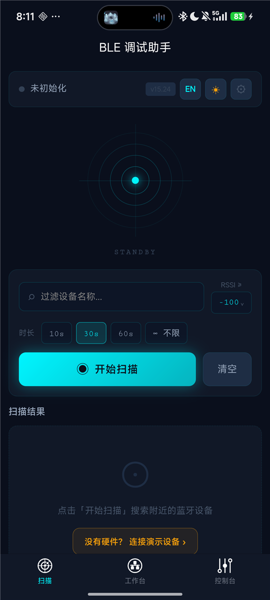 |  |

### 2.3 十分钟上手路线

1. 扫描并连接设备，进入**控制台**。
2. 切到「命令」页，点内置模板命令的 ▶，观察 PASS / FAIL。
3. 点「＋」新建命令，载荷里用 `{{sum}}` 之类的占位符，保存后执行。
4. 长按命令「保存最近执行为样例」，样例进入集合。
5. 到**工作台**点「导出调试包」，把 zip 发给同事或 AI。
6. 在「集合与插件」里导入同事或 AI 回传的 collection.json / zip。

---

## 3. 界面导览

底部三个 Tab：

| Tab | 职责 |
|---|---|
| **扫描** | 发现设备、过滤、连接、最近连接、Mock 模式入口 |
| **工作台** | 已连接设备总览：RSSI、MTU、服务树与接口注释、集合 chip、导出调试包 |
| **控制台** | 实时收发：命令集合面板 + 通信日志 + 发送区 + 协议解析 + 心跳 |

从工作台还能进入：**集合与插件**（集合管理、导入、解析插件）、**集合详情**、**传输历史**。

宽屏（平板、横屏、≥768px）自动切换为多栏布局，左侧固定导航条替代底部 Tab。

---

## 4. 扫描与连接

- **过滤**：按设备名子串和最小 RSSI 过滤。
- **时长**：10s / 30s / 60s / 不限。
- **设备卡片**：信号强度条、设备 ID、广播中的服务 UUID chips、可连接 / 已连接 / MOCK 标记、PIN 配置按钮。
- **PIN**：为需要口令的设备保存 PIN，可配置连接后自动写入指定特征值。
- **最近连接**：一键重连；带 🕓 的可直接进传输历史。
- **多设备**：连接不打断扫描，可继续添加设备；控制台顶部有设备 Tab 切换。

连接成功后自动跳到控制台。

---

## 5. 控制台

### 5.1 通信日志

- 每条记录带方向（TX / RX / SYS）、时间、端点、字节数。
- HEX / ASCII / DUAL 三种显示。
- 「自动」滚动开关；有心跳记录时出现 ♥ 过滤按钮。
- **解码 chips**：命令有响应字段表、或该特征值在内置模板 / 集合里定义了字段表时，RX 会解码成 `字段=值` 显示；TX 按请求字段表解码。
- **长按 TX** 可以：保存为协议样例、**配对保存为样例**（自动匹配 2 秒内的响应）、由此生成命令定义。长按 RX 保存为协议样例。


### 5.2 发送区

- 选择特征值后可发送；HEX 模式自动过滤非法字符，ASCII 模式原样发送。
- **模板**：输入框支持 `{{len}}` `{{sum}}` `{{变量}}` 等占位符，工具栏 **ƒ** 按钮可插入占位符，下方实时显示渲染后的字节；有错误时显示原因并禁用发送。
- 快捷命令 chips：点击填入；「＋」把当前内容存为快捷命令。

| 模板输入与预览 | 发送后 Mock 按规则应答 |
|---|---|
| 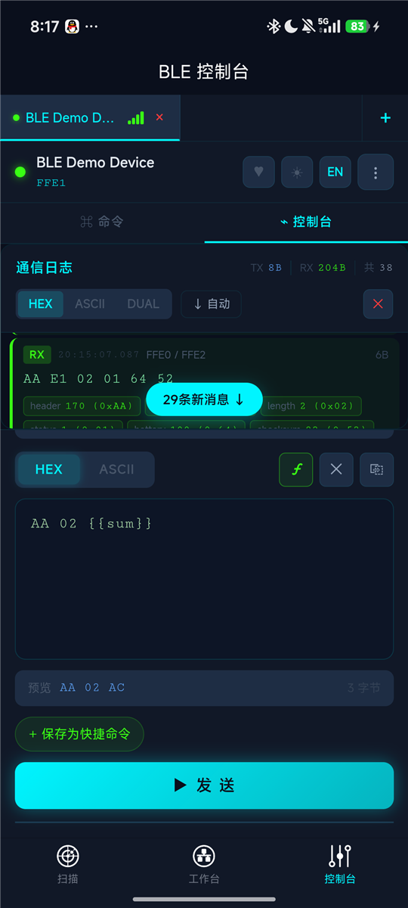 | 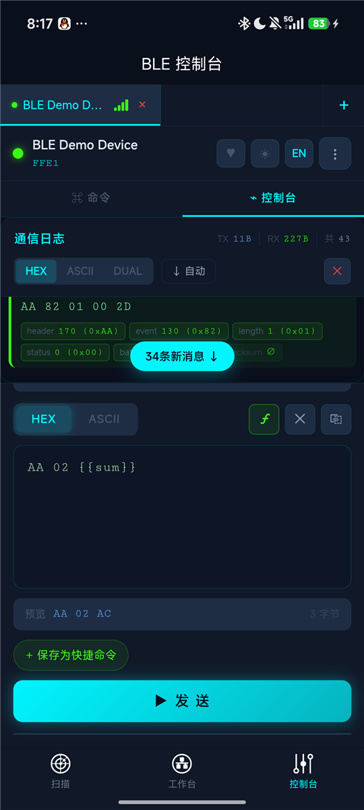 |

### 5.3 其他

- 头部：NOTIFY 开关、♥ 心跳测试、主题 / 语言快切。
- ⋮ 菜单：读取特征值、特征值历史（值 Diff）、清空日志、设置、断开。
- 协议解析：RAW / UART / 自定义 JS 插件解析最近一条 RX。

---

## 6. 命令集合

控制台的「命令」页是 Postman 风格的命令面板：按服务 → 特征值 → 命令分组，每条命令显示动作、载荷、模板渲染结果、描述、最近 10 次执行的结果圆点和 RTT。


### 6.1 命令来源

- **内置模板**：连接后按服务 UUID 匹配内置协议模板（Generic Command、Nordic UART、Standard GATT），自动列出可执行命令，带「模板」标记，并默认开启期望响应判定。
- **自建**：点「＋」或特征值行的「＋」新建；也可从快捷命令导入、由日志生成。
- **集合**：命令随集合保存，换一台同型号设备、换一部手机导入集合后同样可用。

### 6.2 命令编辑器

| 载荷与占位符 | 期望响应 |
|---|---|
| 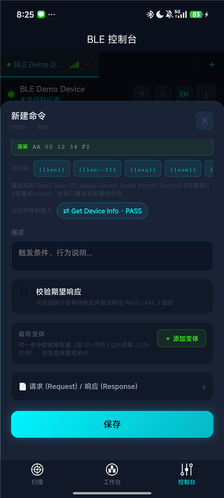 | 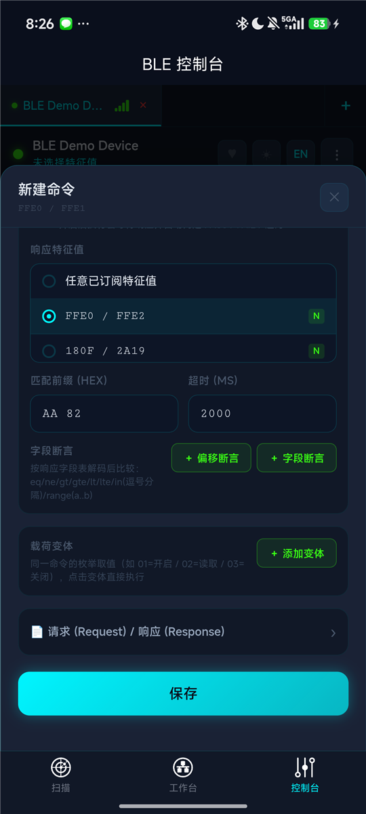 |

- **名称 / Operation ID**：Operation ID 用于和模板合并、导出文档（如 `device.getInfo`）。
- **目标特征值**：刚连接时编辑器会自动发现全部特征值。
- **动作**：WRITE / WRITE NR / READ。
- **载荷**：HEX 或 ASCII，支持模板；下方「渲染」实时显示结果；占位符 chips 一键插入；「从已存样例填入」可用协议样例或集合样例。
- **校验期望响应**：开启后执行会等待响应并判定。可指定响应特征值（执行时自动开启其 Notify）、HEX 前缀、超时。
- **字段断言**：偏移断言（某偏移的字节等于 HEX）或字段断言（按响应字段表解码后比较，见第 8 节）。
- **载荷变体**：同一命令的枚举取值，面板上以 chips 显示，点击直接执行；顺序执行可展开变体。
- **文档字段**：请求 / 响应帧结构、样例、字段表、Mock 规则，进入导出文档。

### 6.3 执行与判定

- ▶ 执行；点击卡片把载荷填入发送区；长按打开菜单。
- 结果：PASS（响应匹配且断言通过）、FAIL（断言不满足）、超时、错误、已发送（未开启期望）。
- 执行记录按设备持久化，导出的 SESSION_LOG.md 有 Operation Runs 段。

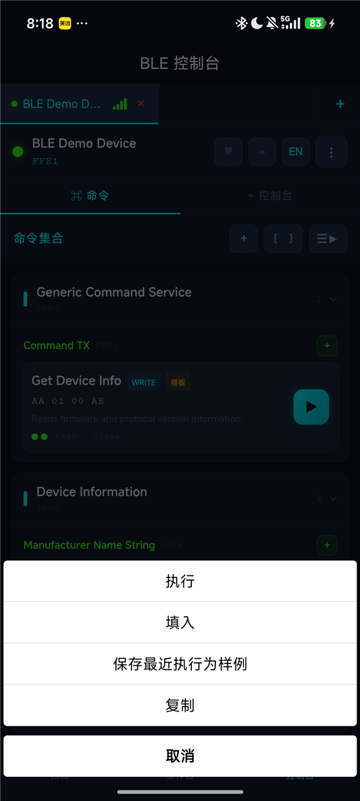

### 6.4 变量与环境

工具栏 `{ }` 打开变量面板：

- **集合变量**：随集合导出，团队共享。
- **设备覆盖**：只存在本机本设备，优先级高于集合变量。
- **序号 `{{seq}}`**：显示当前值，可重置。

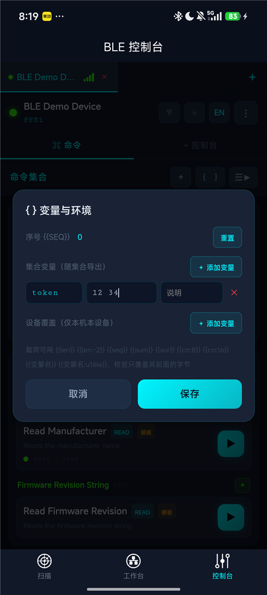

### 6.5 顺序执行（Runner）

工具栏 ☰▶ 进入选择模式，勾选命令后「运行 N 条」。⚙ 打开执行选项：步间延时、循环次数、失败即停、展开变体。运行结束弹出报告：每步 TX / RX / RTT / 结果，汇总 PASS 数与 RTT 均值。

| 执行选项 | 报告 |
|---|---|
| 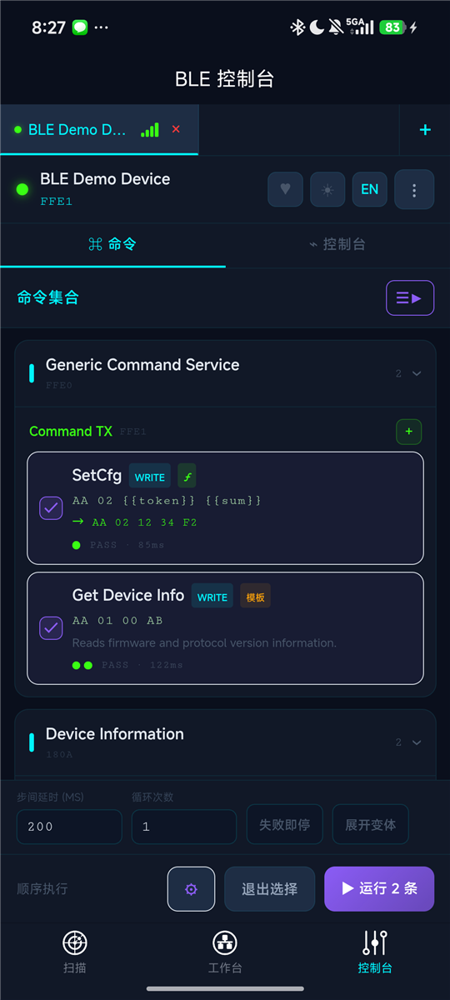 | 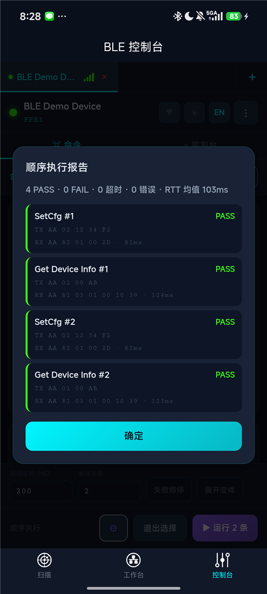 |

### 6.6 样例

- 长按命令「保存最近执行为样例」：把最近一次的请求 + 响应存为配对样例。
- 长按 TX 日志「配对保存为样例」：自动匹配 2 秒内的响应。
- 样例保存在集合里，用于编辑器填入、导出文档、以及生成 Mock 应答规则。

---

## 7. 载荷模板与变量

载荷是 HEX 串，可嵌入 `{{...}}` 占位符。渲染从左到右进行，校验类占位符只覆盖它前面的字节，所以校验和放在最后。

| 占位符 | 含义 | 示例 |
|---|---|---|
| `{{len}}` | 整帧字节数，1 字节 | `AA 01 {{len}} {{sum}}` → `AA 01 04 AF` |
| `{{len:-2}}` / `{{len:+1}}` | 长度加减常量（如 LEN 后面的字节数） | |
| `{{len:u16le}}` / `{{len:-2:u16be}}` | 两字节小端 / 大端 | |
| `{{seq}}` / `{{seq:u16le}}` | 序号，每次含 seq 的发送后自增 | |
| `{{sum}}` / `{{sum:1}}` | 累加和低 8 位；`:1` 表示从偏移 1 开始 | |
| `{{xor}}` / `{{xor:1}}` | 异或校验 | |
| `{{crc8}}` | CRC-8（poly 0x07, init 0x00） | |
| `{{crc16}}` / `{{crc16:0:be}}` | CRC-16/MODBUS，默认小端 | |
| `{{crc16ccitt}}` | CRC-16/CCITT-FALSE，大端 | |
| `{{name}}` | 变量，值为 HEX 字节串 | `token = 12 34` |
| `{{name:u16le}}` / `{{name:ascii}}` | 变量按类型编码，值为十进制 / 0x 十六进制 / 文本 | `addr = 258` → `02 01` |
| `{{name:4}}` | 变量定长，不足补零 | |

ASCII 模式只做 `{{变量}}` 文本替换。

变量解析顺序：设备覆盖 > 集合变量。

---

## 8. 字段类型与断言

字段表的「类型」列使用真实类型，可从选择器选择或手填。自由文本会被规范化，例如 `uint8`、`u16 LE`、`int16BE`、`float`、`string`、`utf-8`、`hex`。

| 类型 | 说明 |
|---|---|
| `u8` `i8` | 无符号 / 有符号 8 位 |
| `u16le` `u16be` `i16le` `i16be` | 16 位，小端 / 大端 |
| `u24le` `u24be` `u32le` `u32be` `i32le` `i32be` | 24 / 32 位 |
| `f32le` `f32be` | IEEE 754 单精度 |
| `bool` | 非零为 true |
| `bitmask` | 按二进制显示 |
| `bcd` | BCD 码 |
| `bytes` | 原始字节（HEX） |
| `ascii` `utf8` | 文本；长度写 `n` 表示到帧尾 |

同一套类型驱动三件事：接收解码、变量 / 变体编码、断言比较。

**字段断言**：选择响应字段表中的字段，比较符支持 `==` `!=` `>` `>=` `<` `<=` `in`（逗号分隔）`range`（`a..b`）。数值可写十进制或 `0x` 十六进制；文本 / 字节字段支持 `==` `!=` `in`。失败原因会带上解码值，例如 `field fwMajor=0: expect >= 1`。

---

## 9. 工作台与导出调试包


- **设备卡**：RSSI、MTU、前往调试、历史、断开；展开后有 RSSI 信号历史、MTU 协商、服务树。
- **服务树**：服务与特征值带属性标签；匹配到内置模板或集合注释时显示名称、方向、值格式、操作数；✎ 编辑服务说明 / 接口文档（含命令列表）。
- **集合 chip**：显示当前设备匹配到的集合；点击可打开集合与插件、复制 JSON、解绑。

### 导出调试包

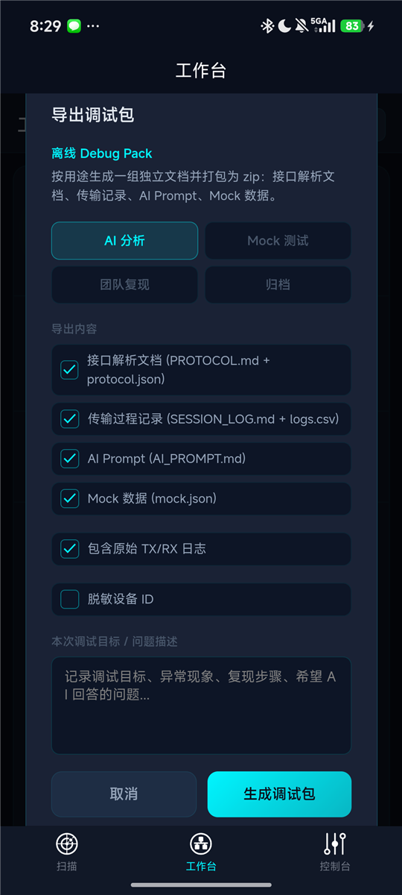

选择用途（AI 分析 / Mock 测试 / 团队复现 / 归档）、要包含的文档、是否含原始日志、是否脱敏设备 ID，填写调试目标后生成 zip 并唤起系统分享。包内文件：

| 文件 | 内容 |
|---|---|
| `README.md` | 包索引 |
| `PROTOCOL.md` / `protocol.json` | 接口文档：服务、特征值、命令、字段表、变量、样例 |
| `collection.json` | 集合文件，可直接导回 App |
| `SESSION_LOG.md` / `logs.csv` | 会话摘要、心跳统计、按端点流量、命令执行记录、时间线 |
| `AI_PROMPT.md` | 给 AI 的上下文与输出要求，说明了集合格式与模板语法 |
| `mock.json` | Mock 种子：变量、样例、与 App 内 Mock 设备一致的应答规则 |

**AI 回写流程**：把 zip 交给 AI，让它补全 `collection.json`（名称、字段表、命令、变量），再在「集合与插件」里导入，选择合并到现有集合并「保留本地」。

---

## 10. 协议集合

### 10.1 概念

- **指纹**：集合记录一组服务 UUID，设备包含全部这些服务即匹配（子集匹配），得分高者优先。可加**设备名规则**（子串或 `/正则/`）。
- **绑定**：显式绑定的设备优先级最高。首次给设备添加注释或命令时会自动创建集合并绑定。
- **拓扑快照**：连接过的服务 / 特征值 / 属性，用于文档和 Mock。
- **内容**：服务与特征值注释、命令、变量、样例。

### 10.2 集合与插件页


- 顶部显示当前设备与匹配到的集合。
- 卡片：名称、来源（自建 / 导入 / 内置）、匹配 / 已绑定标记、统计、指纹 chips、名称规则。
- 点击卡片进详情；「⋯」或长按打开操作：复制 JSON、分享 JSON 文件、编辑信息、绑定 / 解绑当前设备、作为 Mock 设备连接、复制为可编辑集合、删除。
- 下半部分是 JS 解析插件管理。

### 10.3 导入

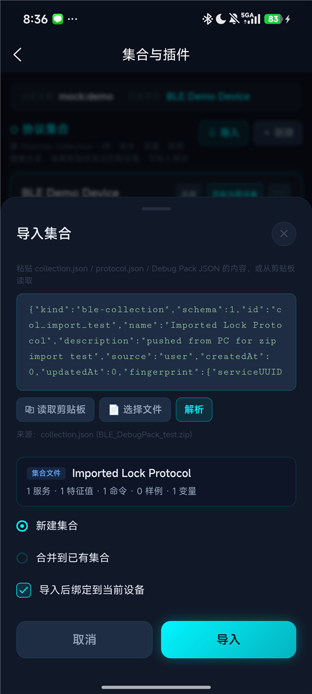

- 来源：粘贴文本、读取剪贴板、**选择文件**（H5 与 Android；支持 `.json` 与 Debug Pack `.zip`，zip 会自动取出 collection.json，其次 protocol.json）。
- 支持格式：collection.json、protocol.json（0.1 / 0.2 / 0.3）、Debug Pack JSON、旧版注释。
- 解析后显示预览与统计，选择**新建集合**或**合并到已有集合**；合并策略「保留本地（只补空缺）」或「以导入内容覆盖」；可勾选导入后绑定当前设备。

### 10.4 集合详情

| 头部 / 指纹与拓扑 / 变量 | 命令 / 样例 | 样例操作 |
|---|---|---|
| 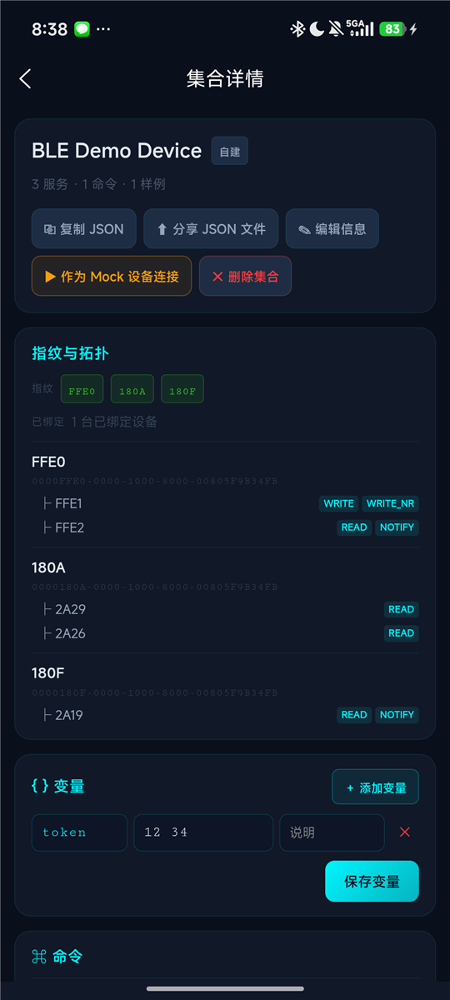 | 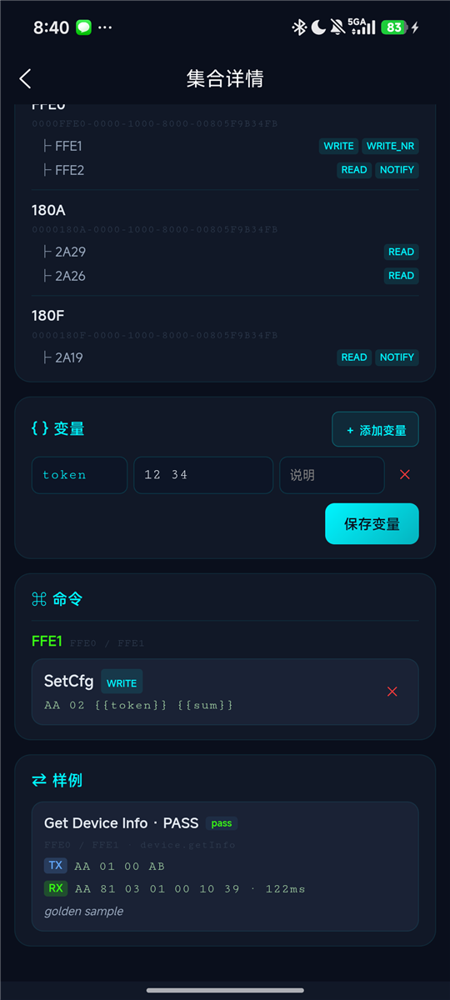 | 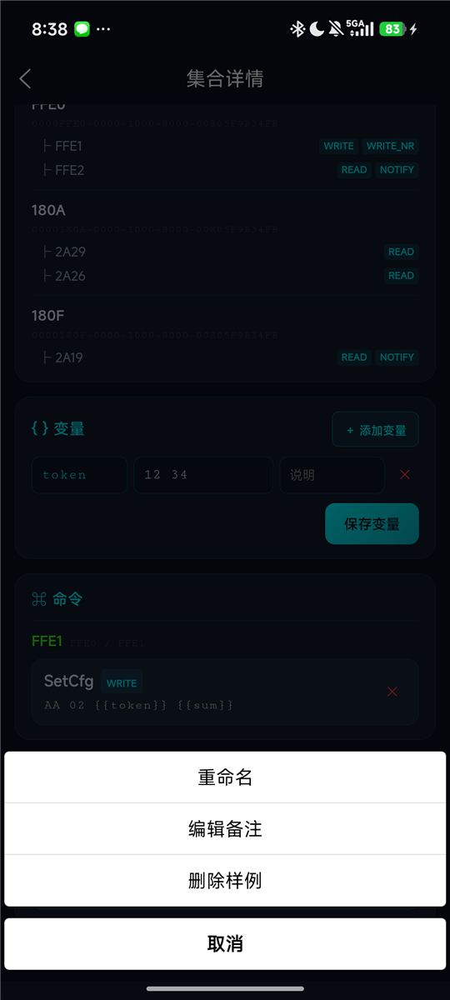 |

- 变量就地编辑并保存。
- 命令：点击进入编辑器（直接写回集合），✕ 删除。
- 样例：点击可重命名、编辑备注、删除。

---

## 11. Mock 模式

在设置里打开「演示 / Mock 模式」，或点击扫描页的「连接演示设备」。

- **演示设备** `BLE Demo Device`：Generic Command Service（FFE1 写命令，FFE2 通知）、Device Information、Battery。规则：`AA 01…` 返回设备信息，`AA 02…` 返回配置应答，`AA 03…` 重启应答，其他 `AA…` 返回 NACK；订阅 FFE2 后每 5 秒推送事件帧；电池订阅后每 10 秒掉 1%。
- **集合 Mock 设备**：每个有拓扑快照的集合生成一台 `<集合名> (Mock)`。应答规则来自：带响应样例的命令（载荷是模板时按前两字节匹配）、配对样例（按请求匹配，延时取样例 RTT）、`request: NONE` 且 Mock 规则含 `every Ns` 的事件接口（周期通知）、READ 命令的响应样例（可读值）。
- 未订阅时的应答会写入可读值，READ 可取到。
- 真实蓝牙不可用（H5、无权限）时进入虚拟扫描，只列出 Mock 设备。

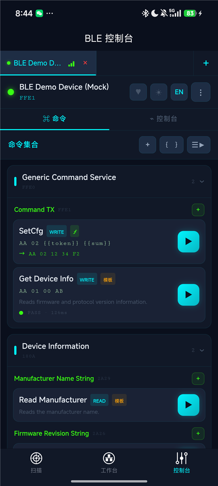

---

## 12. 心跳测试与传输历史

- **心跳测试**：控制台 ♥ 打开。配置写入目标、符合协议的心跳内容、间隔、写入方式、是否校验应答（应答特征值、前缀、超时）。运行中显示发送 / 应答 / 丢失 / 丢失率、RTT 统计与趋势，连续未应答告警；心跳收发进日志并可过滤。
- **传输历史**：每次连接自动录制会话（日志、收发统计、RSSI 范围、MTU、断开原因、心跳统计），按设备分组；可查看时间线、导出单会话 SESSION_LOG.md、删除。

---

## 13. 设置

- 主题：暗色 / 亮色。
- 语言：中文 / English，即时生效。
- 演示 / Mock 模式开关。
- 关于：版本号来自 manifest。

---

## 14. 常见问题

**内置模板命令执行后只显示"已发送"？** 0.2.0 起模板命令默认带期望响应；自建命令请在编辑器里开启「校验期望响应」。

**zip 导入提示无法解压？** 当前 WebView 不支持 DecompressionStream 且原生解压失败时会提示；请解压后导入其中的 collection.json。

**iOS 没有"选择文件"？** iOS 暂未接入文件选择器，请用粘贴或读取剪贴板导入。

**同型号第二台设备没有命令？** 集合按服务指纹匹配；若两台设备服务相同会自动共享。若匹配到错误集合，在集合与插件页把正确集合「绑定到当前设备」。

**Descriptor / 配对状态？** uni-app 蓝牙 API 不暴露，属于平台限制。

**日志面板太矮？** 手机竖屏下日志区固定高度，可在面板内滚动；宽屏或横屏为左右分栏。
